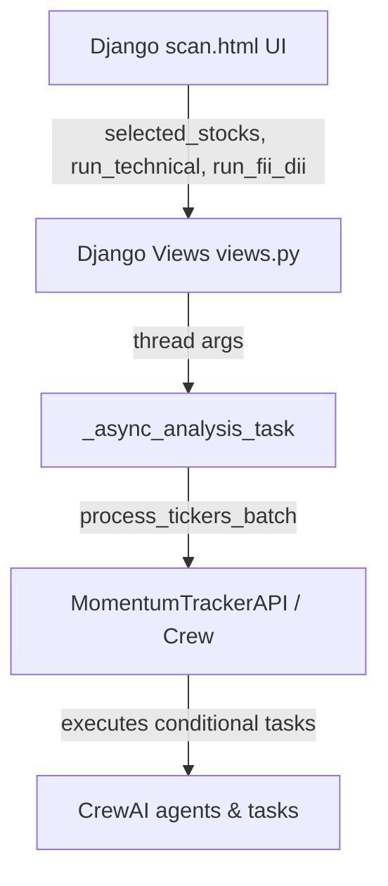

# Integration Guide: Adding FII/DII and Technical Scanner Agents to Django UI & API

This guide provides the complete blueprint for integrating the newly added **FII/DII Flow Analyst** and **Technical Chart Analyst** agents into the Django dashboard interface and the programmatic `MomentumTrackerAPI` interface.

---

## 🏗️ Architectural Overview

We will expose checkboxes in the UI (Step 2 of the Scan page) allowing the user to select which specialist agents to run during the deep-dive analysis. These inputs will flow from the frontend → Django Controller views → background analysis thread → CrewAI kickoff.

---

## 💻 Step-by-Step Implementation

### 1. Update Crew Definition (`crew/stock_discovery_agents.py`)
Modify `run_analyst_batch` and `process_tickers_batch` to accept optional `run_technical` and `run_fii_dii` flags. We conditionally add the agents and tasks, and adjust the final synthesis prompt accordingly.

### 2. Update UI Configuration Form (`dashboard/templates/dashboard/scan.html`)
Add selection switches/checkboxes below the stock checklists in the Step 2 form so users can turn the sub-agents on/off.

### 3. Update Django View (`dashboard/views.py`)
Update `scan_view` and `_async_analysis_task` to read the form checkboxes and pass them down.

### 4. Update the Momentum Tracker API (`momentum_tracker/api.py`)
Add support to expose the modular scans programmatically via the `MomentumTrackerAPI` facade.
