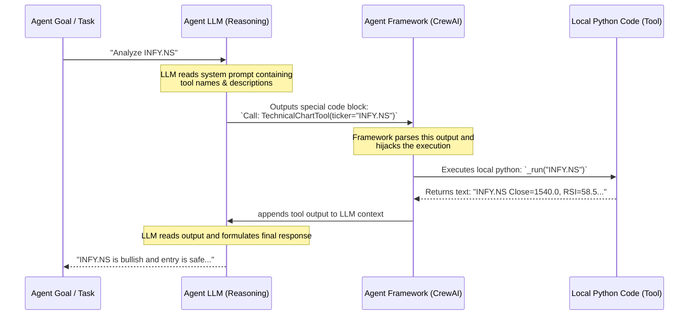

# Agentic AI & Multi-Agent Architecture Q&A

This document contains a structured breakdown of the questions raised about Agentic AI, tool calling, codebase architecture, database integration, and the implementation of our multi-agent enhancement.

---

## 📊 1. Reusing Technical Indicator Calculations

> **Query:** 50-day EMA, 200-day EMA, Relative Strength Index (RSI) --- already having API as part of technical indicator calculation. We should use the same.

### Response
We will absolutely reuse the existing calculations! The codebase defines `TechnicalIndicators` inside [technical_indicators.py](file:///c:/Users/gopal/GOPAL-SHARE/Stock-market-Project/Momentum-Tracker/momentum_tracker/src/technical_indicators.py). 

Our custom tool `TechnicalChartTool` will load the price data via the `StockDatabaseManager` and then call:
* `TechnicalIndicators.ema(df, period=50)`
* `TechnicalIndicators.ema(df, period=200)`
* `TechnicalIndicators.rsi(df, period=14)`

This keeps our calculations stateless, consistent across the application, and easy to maintain.

---

## ⚙️ 2. Tools vs. Direct Function Calls & LLM Invocation

> **Query:** Why do we have tools for function calls? Why not use function calls directly? If we are calling a function via a tool, does it use the LLM for it, or is it just a local function search and no LLM is invoked?

### How Agentic Tool Calling Works
When we give a **Tool** to an LLM agent, the following sequence happens:

### Why Use Tools Instead of Hardcoded Calls?
1. **Dynamic Decision Making**: If we write a standard Python script, we must code the exact execution path beforehand (e.g., *Always fetch INFY.NS, then fetch TCS.NS*). With tools, the LLM decides *if* it needs the tool, *when* to call it, and *what arguments* to pass based on intermediate results (e.g., if a web search reveals a news alert, the agent can decide to run the chart tool on a *different* symbol it discovered in the news).
2. **Abstract Interface**: It allows the LLM to behave like a human programmer, choosing from a toolbox depending on the problem it is trying to solve.

### Does it use the LLM?
* **For decision/parsing**: **Yes, it uses the LLM.** The LLM has to read the task, write the tool call command, and then read the result to explain it.
* **For execution**: **No, it runs locally.** The actual database query, mathematical calculations, or API fetches run directly on your computer. The LLM does not perform calculations or run Python code inside itself; it merely acts as the manager instructing your local Python runtime to do so.

---

## 🏗️ 3. Codebase & Directory Design

> **Query:** Inside crew folder, I have 2 tools momentum_tool and search tool. Apart from it, I have 2 more files portfio manger and stock discovery agents which content multiple agent or code for 1 particular flow. Do you think this design is good. So we should defines agents inside a single files itself and interface should use agents from it.

### Evaluation of Current Design
The current design is **highly structured and modular**:
* **Tools** are placed in separate, standalone files ([momentum_tool.py](file:///c:/Users/gopal/GOPAL-SHARE/Stock-market-Project/Momentum-Tracker/crew/momentum_tool.py) and [search_tool_setup.py](file:///c:/Users/gopal/GOPAL-SHARE/Stock-market-Project/Momentum-Tracker/crew/search_tool_setup.py)). This is excellent because multiple agents and files can reuse these tools without circular imports.
* **Flows** are separated:
  1. [stock_discovery_agents.py](file:///c:/Users/gopal/GOPAL-SHARE/Stock-market-Project/Momentum-Tracker/crew/stock_discovery_agents.py) runs the scanner and processes new stock opportunities.
  2. [portfolio_monitor.py](file:///c:/Users/gopal/GOPAL-SHARE/Stock-market-Project/Momentum-Tracker/crew/portfolio_monitor.py) monitors already-held portfolio positions.

### Recommendations for Learning vs. Production
* **For a large or production app**: The current design is ideal. If you put all agents and tools in a single file, it becomes hundreds of lines long, difficult to navigate, and triggers import conflicts.
* **For learning**: It's helpful to see how components connect across files. However, keeping the main configuration functions (like `_build_agent_and_tasks`) together inside their respective flow files ([stock_discovery_agents.py](file:///c:/Users/gopal/GOPAL-SHARE/Stock-market-Project/Momentum-Tracker/crew/stock_discovery_agents.py)) keeps the codebase organized.

We will keep the current modular structure, defining our new `TechnicalChartTool` in [chart_tool.py](file:///c:/Users/gopal/GOPAL-SHARE/Stock-market-Project/Momentum-Tracker/crew/chart_tool.py) and the `InstitutionalFlowTool` in [institutional_flow_tool.py](file:///c:/Users/gopal/GOPAL-SHARE/Stock-market-Project/Momentum-Tracker/crew/institutional_flow_tool.py).

---

## 🗄️ 4. Fundamental Caching & DB Storage

> **Query:** Since Fundamental analysis is already stored at DB. Can't we use it. We may need latest Quaterly reports and key information from Web which can help fundamentation and technical decision. those should be added to DB also.

### Current Implementation
Right now, `StockDatabaseManager` saves basic parameters (Book Value, Earnings, Sales) in a local cache directory (as `.json` files in `data_cache/fundamental/`), which it uses to calculate ratios.
The Django database (`momentum_portfolio.db` via SQLite/Postgres) does not have tables to store raw quarterly statements or complex web analysis strings. It only stores:
1. Active User Portfolios (symbols, buy price, quantity).
2. Scan runs & final analyst picks.

### How We Can Improve It
To keep this project highly modular and avoid database migration complexity during your learning phase, we can:
1. Read the raw fundamental cache to give the agents a baseline.
2. Use the **Web Search Agent** to fetch the *latest* quarterly surprises, regulatory news, or announcements from the last 30 days.
3. Incorporate these updates directly into the generated analysis report which Django saves to the `picks` and `scan_reports` tables.
4. *Future Step*: We can create a dedicated `FundamentalCache` database table to store quarterly summaries (e.g. EBITDA margins, debt ratios) to prevent repetitive web searches.

---

## 👥 5. Upgrading to a Cooperating Multi-Agent Crew

> **Query:** Lets Add FII and DII monitoring agent also.

We have expanded the scanner to support a **4-Agent Discovery Crew** and a **3-Agent Batch Crew**:
1. **Momentum Scout Agent**: Operates the quantitative scanner backbone.
2. **Technical Chart Analyst Agent**: Evaluates EMAs, RSI, and support/resistance zones via the local `TechnicalChartTool` to rate the entry safety.
3. **FII & DII Flow Analyst Agent**: Evaluates institutional interest (accumulation vs distribution) by querying the FII/DII tracking database via `InstitutionalFlowTool` and performing web searches for recent bulk/block deals or holding structure changes.
4. **Fundamental & Sentiment Analyst Agent**: Operates as the synthesis brain. It receives the output of the technical analyst and flow analyst tasks as context (`context=[task_scan, task_chart_analysis, task_flow_analysis]`) and merges them with sector trends and fundamental reviews to deliver the final `BUY / HOLD / AVOID` classification.

---

## 🗄️ 6. FII & DII Order Flow Analysis & Smart Money Integration

To support the FII/DII Flow Analyst, we integrated:
* **The `InstitutionalFlowTool`**: This tool connects directly to the provisional SQLite database (`fii_dii_tracker/fii_dii_data.db`). It automatically queries:
  1. **Market-Wide Flows**: The latest daily institutional buy/sell values in ₹ Crores.
  2. **Holdings & Bulk Deals**: Historical shareholder percentages (promoters, FIIs, DIIs) and individual bulk/block transaction sizes.
* **Web Search Fallbacks**: If the provisional database tables are currently empty or lack records for a specific small-cap stock, the FII/DII agent uses the `web_search` tool to fetch the latest "FII DII shareholding percentage" or "recent bulk block deals" directly from the web, ensuring the agent remains resilient and robust even with incomplete local data.
