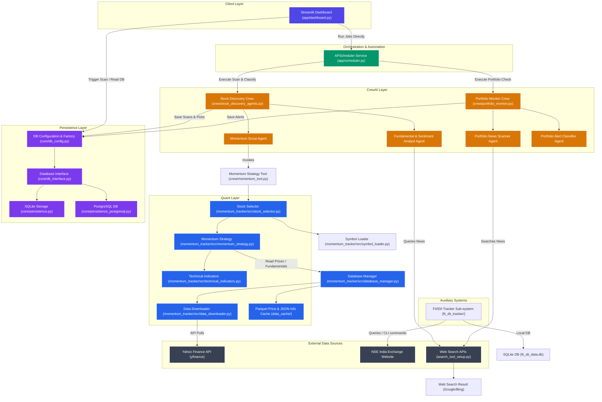
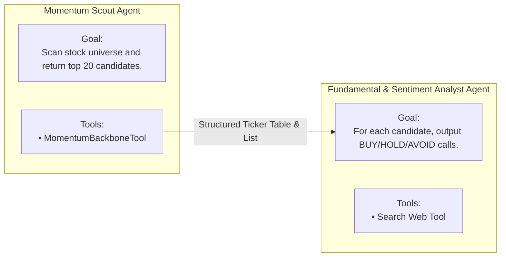
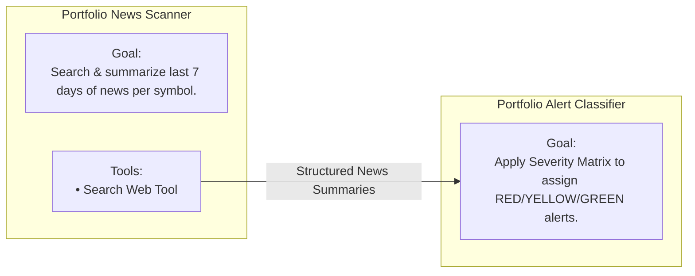
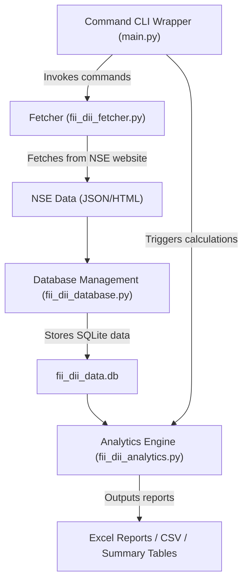

# Momentum Portfolio System — System Architecture Document

This document details the architectural design, component structure, data flow, mathematical algorithms, and database schema of the **Momentum Portfolio System** (Momentum-Tracker).

---

## 1. Architectural Overview

The Momentum Portfolio System is a hybrid quantitative-AI trading automation platform. It combines raw mathematical momentum strategy with multi-agent LLM reasoning (via CrewAI) for fundamental verification, sentiment checking, and real-time portfolio monitoring.

### High-Level System Architecture



---

## 2. Component Architecture & System Decomposition

### A. Client Layer (`app/dashboard.py`)
A comprehensive, interactive web interface powered by **Streamlit**. It acts as the command center for the entire portfolio system, featuring:
*   **Portfolio Overview**: Displays active open positions, purchase metrics (quantity, average cost), and real-time color-coded alert badges (🔴 RED, 🟡 YELLOW, 🟢 GREEN). It allows manual trade execution to close positions.
*   **Trade Executor (Add/Remove Stocks)**: Interface to record trade entries (buy price, ticker, quantity).
*   **Run Momentum Scan**: Triggers one-off, synchronous scans on chosen NSE index universes.
*   **Scan History**: Interactive display of the latest WMS ranked tables, color-coded analyst selections (picks), and Plotly visualizations of sector concentrations.
*   **Scan Reports**: Allows audit review and deletion of raw reports generated by the CrewAI agents.
*   **Performance Tracker**: Visualizes closed-trade P&L, overall win rate, average holding period, and provides a breakdown of trade performance by the analyst's original classification conviction.

### B. Orchestration & Automation Layer (`app/scheduler.py`)
The background execution harness powered by **APScheduler** (Advanced Python Scheduler). 
*   Runs on a weekday cron schedule optimized for the Indian stock market (Monday to Friday):
    *   **08:15 IST**: Triggers `job_scan_and_classify` (scans specified stock universe, extracts top candidates, runs analyst review, saves records).
    *   **08:45 IST**: Triggers `job_monitor` (extracts held positions from the DB, runs news-based risk monitor, records alerts).
*   Encapsulates string parsers to transform plain-text output from CrewAI tasks back into structured records (JSON-like arrays) for database ingestion.
*   Supports a `--once` CLI flag for manual testing/dry-runs.

### C. CrewAI Layer (`crew/`)
A multi-agent AI system structured into two primary pipelines:

1.  **Stock Discovery Crew** (`stock_discovery_agents.py`):
    *   **Momentum Scout**: Executes the quantitative scanning engine using a custom tool (`MomentumBackboneTool`) to rank the top 20 momentum leaders in a chosen universe (e.g. Nifty100).
    *   **Fundamental & Sentiment Analyst**: Consumes tickers from the Scout. Conducts searches using a custom Google Search Tool wrapper (`search_tool_setup.py`) to gather quarterly earnings, block deals, and macroeconomic headwinds. Returns a structured classification (BUY / HOLD / AVOID) with a 1-5 confidence score.
    *   *Contrarian Rule Enforcement*: Automatically demotes the classification if the stock is top-ranked by technical momentum but shows "stretched" or "unsupported" fundamentals.
2.  **Portfolio Monitor Crew** (`portfolio_monitor.py`):
    *   **Portfolio News Scanner**: Periodically monitors news articles published in the last 7 days for tickers currently held in the portfolio.
    *   **Portfolio Alert Classifier**: Scores stories against a predefined severity framework. It outputs structured alerts (RED, YELLOW, GREEN) with risk factors and explicit exit/hold instructions.
    *   *Conservative Bias Rule*: Errs on the side of caution (e.g., green-yellow uncertainty defaults to YELLOW; yellow-red defaults to RED) to prioritize capital preservation.

### D. Quantitative Core Engine (`momentum_tracker/src/`)
A stateless, mathematical layer that calculates metrics, ranks stocks, and maintains local data caches:
*   **Technical Indicator Engine** (`technical_indicators.py`): Pure, NumPy/Pandas-based implementations of indicators (RSI, MFI, CCI, EMA, and custom Relative Strength metrics) optimized for performance and testability.
*   **Momentum Strategy** (`momentum_strategy.py`): Orchestrates stock filtration. It implements a multi-stage funnel: Stage 1 (liquidity, absolute price, and EMA trend-alignment filters), Stage 2 (relative strength/percentile cutoffs), and Stage 3 (Weighted Momentum Score calculation).
*   **Database Manager** (`database_manager.py`): Implements a two-layer cache (in-memory dict + local files). It stores historical price data as **Parquet** files (optimizing data-type serialization and disk I/O speed) and fundamental data as JSON files. Stale data triggers an incremental update (fetching only missing date ranges via `yfinance`) to avoid API rate limits.

### E. Database Abstraction Layer (`core/`)
Implements a clean provider-switching design:
*   **DBConfig** (`db_config.py`): Centralizes database credentials. It reads from the environment, defaulting to local SQLite or routing to PostgreSQL if `DB_TYPE=postgresql` is set.
*   **DatabaseInterface** (`db_interface.py`): Python protocol/abstract class defining all persistent database operations.
*   **SQLite Database Handler** (`persistence.py`): SQLite implementation using Write-Ahead Logging (WAL) mode to permit concurrent reads and writes between the web dashboard and background scheduler.
*   **Postgres Database Handler** (`persistence_postgresql.py`): PostgreSQL implementation utilizing `psycopg2`'s `execute_batch` utility for high-throughput writing.

---

## 3. Mathematical & Algorithmic Core

The system ranks stocks using a multi-factor quantitative approach. The technical indicators and score calculations are detailed below:

### Custom Technical Indicators

#### 1. Rate of Change (ROC) Composite
Instead of evaluating momentum over a single timeframe, the system computes a weighted composite rate of change over three lookback windows (default: 60-day, 40-day, and 20-day):

$$\text{Composite ROC} = \frac{\sum (w_i \times \text{ROC}_{p_i})}{\sum w_i} \times 100$$

Where:
*   $p = [60, 40, 20]$ days.
*   $w = [0.35, 0.40, 0.25]$ weights (giving higher prominence to mid-term price velocity).
*   $\text{ROC}_{t} = \frac{\text{Close}_{\text{Today}} - \text{Close}_{t\text{ Days Ago}}}{\text{Close}_{t\text{ Days Ago}}}$.

#### 2. Smoothed Relative Strength Ratio (RS-MA Ratio)
Measures the acceleration of a stock's outperformance relative to a benchmark index (e.g. Nifty 50, `^NSEI`):

$$\text{RS Line}_t = \frac{\text{Close}_{\text{Stock}, t}}{\text{Close}_{\text{Bench}, t}}$$

$$\text{RS MA}_t = \text{SMA}(\text{RS Line}, \text{lookback}=55)_t$$

$$\text{RS-MA Ratio} = \left( \frac{\text{RS Line}_t}{\text{RS MA}_t} \right) - 1.0$$

*   $\text{RS-MA Ratio} > 0$ indicates relative strength is trending upwards (momentum acceleration).
*   $\text{RS-MA Ratio} < 0$ indicates relative strength is declining.

#### 3. Return-based Relative Strength (Vivek Bajaj RS-N Ratio)
Provides point-to-point relative return outperformance:

$$\text{RS-N Ratio} = \frac{\text{Close}_{\text{Stock}, \text{Today}} / \text{Close}_{\text{Stock}, N\text{ Days Ago}}}{\text{Close}_{\text{Bench}, \text{Today}} / \text{Close}_{\text{Bench}, N\text{ Days Ago}}} - 1.0$$

#### 4. Price Momentum Composite (P-Score)
Scores overall absolute trend velocity using long, medium, and short time horizons, including proximity to the 52-week high price:

$$\text{P-Score} = \frac{1.0 \times \text{ROC}_{12\text{M}} + 2.0 \times \text{ROC}_{6\text{M}} + 2.0 \times \text{ROC}_{3\text{M}} + 0.5 \times \text{Dist}_{52\text{W High}}}{\sum w_i} \times 100$$

$$\text{Dist}_{52\text{W High}} = \frac{\text{Close}_{\text{Today}}}{\max(\text{High}_{\text{Last 252 Days}})} - 1.0$$

#### 5. Value Composite (V-Score)
Calculates fundamental value based on yfinance metrics. This score penalizes highly inflated multiples and is used in percentile filtering:

$$\text{V-Score} = \text{Average}\left( \frac{1}{\text{Price-to-Book}}, \frac{1}{\text{Trailing PE}}, \frac{1}{\text{Price-to-Sales}} \right)$$

---

### Quantitative Funnel and WMS Scoring Process

The system processes stock selections in three distinct stages:

```mermaid
graph TD
    %% Funnel Steps
    Step0["Target Universe Tickers (Nifty 100, Nifty 500, etc.)"] --> Step1
    
    subgraph Stage 1: Technical & Trend Filters
        Step1["Base Filters:<br>• Price >= Min Floor (1.0)<br>• Avg 20-Day Volume >= Min Floor (10k)<br>• EMA Bullish Alignment (Price > EMA50 > EMA200)<br>• Momentum Consistency (RSI > 50 & ROC > 0 on x/y days)"]
    end
    
    Step1 -->|Pass| Step2
    
    subgraph Stage 2: Relative Percentile Screens
        Step2["Percentile Calculations:<br>Compute 0-100 percentile rank for all raw scores across active universe.<br><br>Percentile Filters:<br>• P-Score Percentile >= MIN_P_SCORE_PCT (50)<br>• V-Score Percentile >= MIN_V_SCORE_PCT (50)<br>• Relative Strength: RS-55 > 0<br>• RSI > 50"]
    end
    
    Step2 -->|Pass| Step3
    
    subgraph Stage 3: Weighted Momentum Score (WMS)
        Step3["WMS Calculation:<br>• 60% WMS_ROC_Composite Percentile<br>• 5% RSI Percentile<br>• 20% MFI Percentile<br>• 15% CCI Percentile"]
    end
    
    Step3 --> Step4["Top N Stocks Sorted by WMS Score"]
```

---

## 4. Database Schema Design

The system maps data models identically to SQLite and PostgreSQL tables. Database fields are structured as follows:

### 1. `scan_runs` (Header table for tracking scans)
| Column | Type | Constraints | Description |
| :--- | :--- | :--- | :--- |
| `id` | INTEGER / SERIAL | PRIMARY KEY | Unique run identifier |
| `run_at` | TEXT | NOT NULL | ISO 8601 Timestamp of run execution |
| `category` | TEXT | NOT NULL | Universe name (e.g. `Nifty100`, `Midcap150`) |
| `total_scored` | INTEGER | | Total stocks processed in this run |
| `top_n` | INTEGER | | Number of candidates requested to export |

### 2. `scans` (Details table for quantitative scores)
| Column | Type | Constraints | Description |
| :--- | :--- | :--- | :--- |
| `id` | INTEGER / SERIAL | PRIMARY KEY | Unique record identifier |
| `run_id` | INTEGER | REFERENCES `scan_runs(id)` | Linked header identifier |
| `symbol` | TEXT | NOT NULL | NSE Stock Ticker (e.g., `TCS.NS`) |
| `rank` | INTEGER | | WMS Rank position |
| `wms` | REAL | | Final Weighted Momentum Score |
| `rs` | REAL | | Raw Relative Strength value |
| `rsi` | REAL | | Raw Relative Strength Index value |
| `mfi` | REAL | | Raw Money Flow Index value |
| `cci` | REAL | | Raw Commodity Channel Index value |

### 3. `picks` (Accountability table for analyst calls)
| Column | Type | Constraints | Description |
| :--- | :--- | :--- | :--- |
| `id` | INTEGER / SERIAL | PRIMARY KEY | Unique record identifier |
| `run_id` | INTEGER | REFERENCES `scan_runs(id)` | Linked header identifier |
| `symbol` | TEXT | NOT NULL | NSE Stock Ticker |
| `classification` | TEXT | NOT NULL | `BUY` \| `HOLD` \| `AVOID` |
| `confidence` | INTEGER | | convicton rating: `1` (lowest) to `5` (highest) |
| `momentum_quality` | TEXT | | `SUPPORTED` \| `STRETCHED` \| `UNSUPPORTED` |
| `sector_backdrop` | TEXT | | Macro tailwind or headwind summary |
| `fundamental` | TEXT | | Revenue growth, margin, and debt status |
| `news_catalysts` | TEXT | | Key recent announcements |
| `risk_flags` | TEXT | | Major business or financial risks |
| `rationale` | TEXT | | Summary rationale statement |
| `picked_at` | TEXT | NOT NULL | Pick creation timestamp |

### 4. `alerts` (Risk tracking table)
| Column | Type | Constraints | Description |
| :--- | :--- | :--- | :--- |
| `id` | INTEGER / SERIAL | PRIMARY KEY | Unique alert identifier |
| `symbol` | TEXT | NOT NULL | NSE Stock Ticker |
| `alert_level` | TEXT | NOT NULL | `RED` \| `YELLOW` \| `GREEN` |
| `confidence` | TEXT | | `HIGH` \| `MEDIUM` \| `LOW` |
| `trigger` | TEXT | | Specific news trigger event |
| `action` | TEXT | | Action directive (e.g., stop-loss guidelines) |
| `risk_flags` | TEXT | | Relevant risk categories |
| `raw_news` | TEXT | | JSON string representing investigated stories |
| `alerted_at` | TEXT | NOT NULL | Timestamp of alert evaluation |

### 5. `portfolio` (Portfolio holdings - source of truth)
| Column | Type | Constraints | Description |
| :--- | :--- | :--- | :--- |
| `id` | INTEGER / SERIAL | PRIMARY KEY | Unique portfolio row ID |
| `symbol` | TEXT | NOT NULL, UNIQUE | NSE Stock Ticker |
| `buy_price` | REAL | NOT NULL | Cost basis per share |
| `qty` | INTEGER | NOT NULL | Share quantity held |
| `added_at` | TEXT | NOT NULL | Trade entry timestamp |
| `status` | TEXT | DEFAULT `'OPEN'` | Status: `OPEN` \| `CLOSED` |

### 6. `performance` (P&L Audit table for closed positions)
| Column | Type | Constraints | Description |
| :--- | :--- | :--- | :--- |
| `id` | INTEGER / SERIAL | PRIMARY KEY | Performance record ID |
| `symbol` | TEXT | NOT NULL | NSE Stock Ticker |
| `buy_price` | REAL | NOT NULL | Purchase cost basis |
| `sell_price` | REAL | NOT NULL | Exit trade price |
| `qty` | INTEGER | NOT NULL | Quantity of shares closed |
| `pnl` | REAL | NOT NULL | Nominal P&L: `(sell_price - buy_price) * qty` |
| `pnl_pct` | REAL | NOT NULL | Percentage P&L: `(sell_price / buy_price - 1) * 100` |
| `hold_days` | INTEGER | | Holding duration in calendar days |
| `opened_at` | TEXT | | Open trade timestamp |
| `closed_at` | TEXT | NOT NULL | Closed trade timestamp |
| `pick_classification` | TEXT | | Pick classification at buy time |
| `exit_reason` | TEXT | | `MANUAL` \| `RED_ALERT` \| `TARGET_HIT` \| `STOP_LOSS` |

### 7. `scan_reports` (Full report audit table)
| Column | Type | Constraints | Description |
| :--- | :--- | :--- | :--- |
| `id` | INTEGER / SERIAL | PRIMARY KEY | Report record ID |
| `run_id` | INTEGER | REFERENCES `scan_runs(id)` | Linked header identifier (null if independent) |
| `category` | TEXT | NOT NULL | Scanned index category name or `'Monitor'` |
| `scout_raw` | TEXT | | Full WMS ranked tables text output |
| `analyst_raw` | TEXT | | Full raw text response from the CrewAI Analyst |
| `report_type` | TEXT | DEFAULT `'SCOUT'` | `'SCOUT'` \| `'MONITOR'` |
| `created_at` | TEXT | NOT NULL | Audit record creation timestamp |

---

## 5. CrewAI Agent Configurations

The system sets up specialized agents, goals, backstories, and operational tasks.

### Stock Discovery Crew (Scout-Analyst flow)



#### Detailed Prompts and Output Fields

1.  **Momentum Scout Agent**
    *   **Goal**: "Identify the highest-momentum NSE stocks by running the quantitative momentum backbone and returning a clean, ranked candidate list."
    *   **Backstory**: "You are a quantitative analyst specializing in price-momentum strategies for Indian equity markets. You operate the multi-factor WMS scoring engine and surface the stocks with the strongest risk-adjusted momentum."
    *   **Expected Task Output**: The scout returns a ranked table displaying columns for `Rank`, `Symbol`, `WMS`, `RS`, `RSI`, `MFI`, `CCI`, followed by a line starting with `"TICKERS:"` containing a comma-separated list of symbols (e.g. `INFY.NS, TCS.NS`).
2.  **Fundamental & Sentiment Analyst Agent**
    *   **Goal**: "For each momentum candidate, deliver a structured, evidence-based assessment covering sector backdrop, recent catalysts, fundamental health, and a BUY / HOLD / AVOID classification with a 1-5 confidence score."
    *   **Backstory**: "You are a seasoned buy-side analyst covering Indian equities. You combine top-down macro views (RBI policy, FII flows, commodity cycles) with bottom-up checks (revenue growth trajectory, debt load, promoter holding, recent quarterly surprises). You flag when price momentum is unsupported by fundamentals."
    *   **Enforced Output Structure per Stock**:
        ```text
        SYMBOL: <TICKER>
        CLASSIFICATION: BUY | HOLD | AVOID
        CONFIDENCE: 1-5
        SECTOR BACKDROP: <Summary of macro tailwind or headwind>
        FUNDAMENTAL HEALTH: <Revenue, margins, debt, earnings surprises>
        NEWS CATALYSTS: <Positive or negative events in the last 30 days>
        MOMENTUM QUALITY: SUPPORTED | STRETCHED | UNSUPPORTED
        RISK FLAGS: <List flags, or 'None'>
        MEMORY NOTE: < Thesis changes vs prior scans >
        ONE-LINE RATIONALE: <Summary case statement>
        ---
        ```

---

### Portfolio Monitoring Crew (Risk-Alert Flow)



#### Evaluation Framework (Severity Matrix)
The Portfolio Alert Classifier applies the following rule matrix to evaluate held positions:

*   **🔴 RED — EXIT IMMEDIATELY**: Triggered by any single occurrence of:
    *   Fraud allegation, regulatory investigation (e.g., SEBI, Enforcement Directorate).
    *   Revenue or Earnings-per-share guidance cut $> 10\%$.
    *   Resignation of executive management (CEO, CFO, MD) or promoter bulk sell-offs.
    *   Credit rating downgrade by a major agency (CRISIL, ICRA, Moody's, India Ratings).
    *   Regulatory ban, trading suspension, or license cancellation.
    *   Foreign Institutional Investor (FII) net selling exceeding 3% of float in a single week.
    *   Promoter pledge exceeding 60% of total promoter holding.
    *   Any negative news story evaluated with a **HIGH** price impact.
*   **🟡 YELLOW — WATCH CLOSELY / TRIM**: Triggered by any two occurrences of (or one HIGH-MEDIUM negative event):
    *   Quarterly Profit After Tax (PAT) miss compared to analyst consensus.
    *   Increase in promoter pledge $> 10\%$ compared to the previous quarter.
    *   New regulatory compliance burden impacting operational cost margins.
    *   Broker rating downgrades to "Sell" or "Underperform".
    *   Sector-wide input cost spikes (e.g. raw material, crude oil, or API spikes).
    *   Stagnant price movement or unusual volume spikes without material tailwinds.
    *   Any negative news story evaluated with a **MEDIUM** price impact.
*   **🟢 GREEN — HOLD**:
    *   Earnings beat, positive earnings guidance, or key block deal accumulation.
    *   Absence of negative news stories within the last 7 trading days.

---

## 6. FII / DII Tracker Sub-System (`fii_dii_tracker/`)

The Foreign Institutional Investor (FII) and Domestic Institutional Investor (DII) Tracker is an independent analytics sub-system. It monitors net trading volume flows in the Indian equities market to measure institutional sentiment.



### Modules inside FII/DII Tracker
1.  **Fetcher** (`fii_dii_fetcher.py`):
    *   Connects to NSE India server endpoints, simulating browser request headers to fetch institutional market activities.
    *   Fetches daily, weekly, and monthly aggregate flow datasets.
    *   Fetches sector indices constituents, block deal logs, and bulk trading deals.
2.  **Database Handler** (`fii_dii_database.py`):
    *   Manages `fii_dii_data.db` database.
    *   Tables include: `fii_dii_aggregate` (dates, FII buy/sell, DII buy/sell), `sector_stocks` (symbol, sector index name), `bulk_deals` (symbol, client name, trade type, quantity, average price), and `watchlist` (user-tracked stocks with custom notes).
3.  **Analytics Engine** (`fii_dii_analytics.py`):
    *   Aggregates institutional transactions, calculating net flows.
    *   Derives sector scoring benchmarks (combines sector index trends with institutional transaction weights).
    *   Generates multi-sheet Excel reports detailing transaction trends and volume anomalies.
4.  **CLI Runner** (`fii_dii_tracker/main.py`):
    *   Command-line utility exposing tasks: `fetch` (period-specific flow updates), `refresh` (complete market data downloads), `report` (Excel/CSV report generation), and `watch` (watchlist configurations).

---

## 7. Multi-Environment & Deployment Architecture

The system can switch between local development and cloud production environments.

### Local Development Environment
*   **Database**: SQLite file (`data_cache/momentum.db`), using WAL journal mode for parallel Streamlit read/write operations.
*   **LLM Integration**: Locally declared API keys in a `.env` file, invoking Gemini or OpenAI models.
*   **Price Cache**: Parquet files inside `mps_cache/price` and JSON fundamental snapshots in `mps_cache/fundamental`.

### Cloud Production Environment (Render / Railway / Heroku)
*   **Database**: PostgreSQL DB instance managed via connection URLs (`DATABASE_URL`). Schema tables and indexes are generated dynamically at application startup.
*   **Environment Configuration**: The env variable `DB_TYPE` is set to `postgresql`. Connection arguments are fetched from env vars (e.g. `PG_HOST`, `PG_USER`).
*   **Background Jobs**: Background schedulers are deployed using separate process workers (`web` runs Streamlit; `worker` runs the background APscheduler service, or `railway.json` / `render.yaml` definitions invoke cron worker containers).
