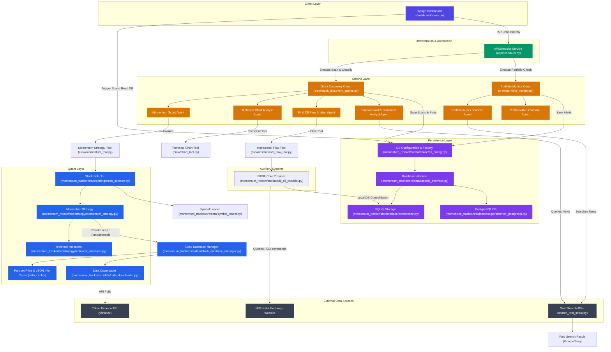
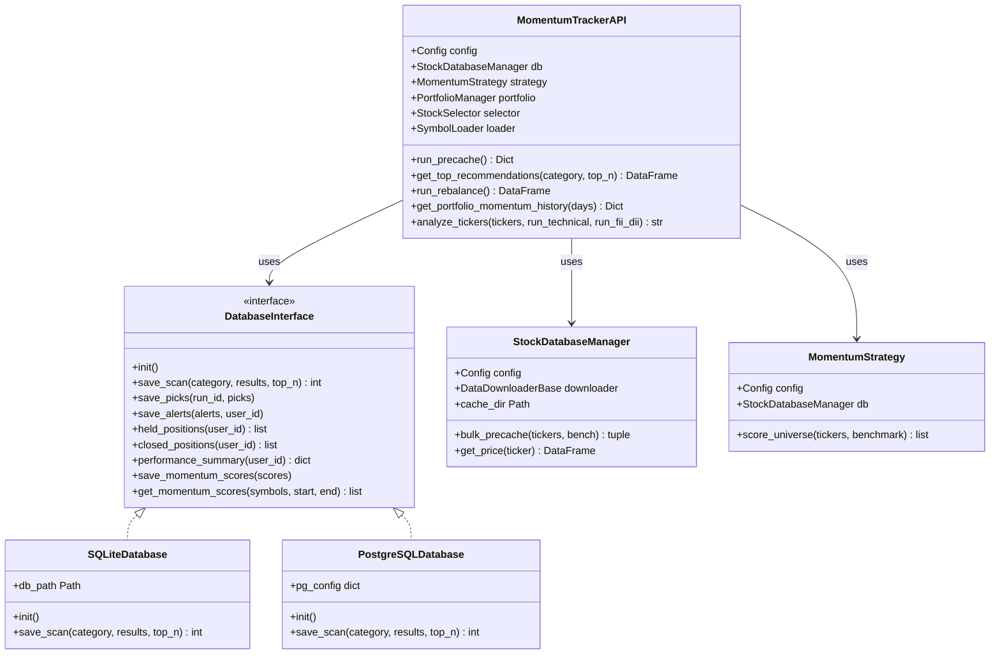
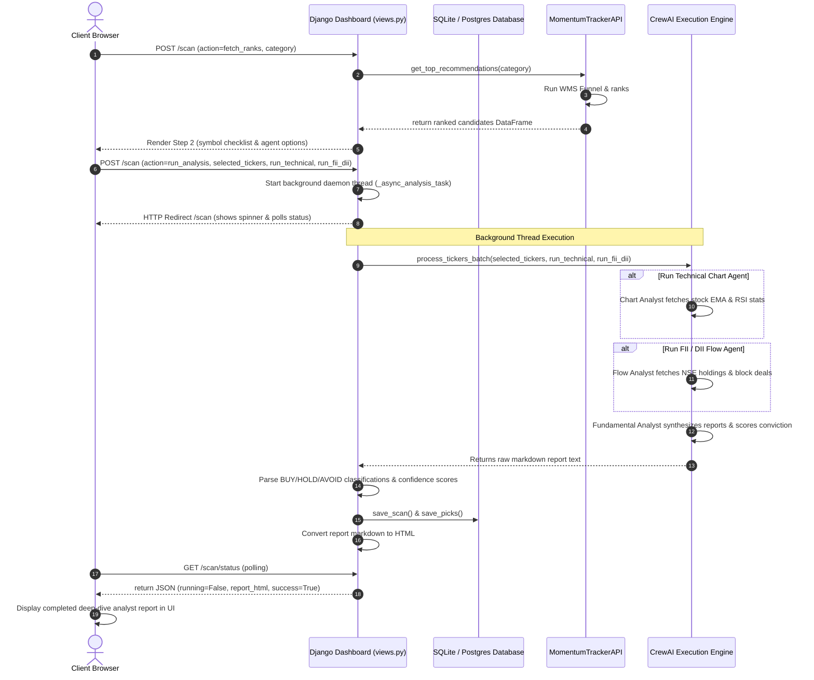

# Momentum Portfolio System — System Architecture Document

This document details the architectural design, component structure, class relationships, sequence of operations, mathematical algorithms, and database schema of the **Momentum Portfolio System** (Momentum-Tracker).

---

## 1. Architectural Overview

The Momentum Portfolio System is a hybrid quantitative-AI trading automation platform. It combines raw mathematical momentum strategy with multi-agent LLM reasoning (via CrewAI) for fundamental verification, sentiment checking, and real-time portfolio monitoring.

### High-Level System Architecture

---

## 2. Structural & Class Relationships

The core quantitative and persistence APIs are exposed through a unified API Facade (`MomentumTrackerAPI`), which provides modular access to scanners, rebalancers, and database persistence layers.

---

## 3. Dynamic Operations & Sequence Flow

This sequence diagram illustrates the **2-Stage Interactive Scan & Deep-Dive** workflow from the user's browser, through the Django controllers, to the background thread orchestrating the selectable CrewAI sub-agents.

---

## 4. Component Architecture & System Decomposition

### A. Client Layer (`dashboard/views.py` & templates)
A comprehensive, interactive web interface powered by **Django**. It manages user authentication and partitions data securely.
*   **User Authentication**: Fully partitioned login, signup, and registration modules.
*   **Portfolio Overview**: Displays active open positions, purchase metrics, and real-time color-coded alert badges (🔴 RED, 🟡 YELLOW, 🟢 GREEN) filtered securely for the logged-in user.
*   **Run Momentum Scan (2-Stage Interactive)**: Instantly computes WMS ranked candidates in Stage 1, displays an interactive checklist to choose symbols, exposes switches to enable/disable the Technical and FII/DII Flow agents, and triggers the CrewAI pipeline in a background thread.
*   **Performance Tracker**: Visualizes closed-trade P&L, overall win rate, average holding period, and performance breakdowns.

### B. Orchestration & Automation Layer (`streamlite_app/scheduler.py`)
The background execution harness powered by **APScheduler**.
*   Runs on a weekday cron schedule optimized for the Indian stock market (Monday to Friday):
    *   **08:15 IST**: Triggers `job_scan_and_classify` (scans specified stock universe, extracts top candidates, runs analyst review, saves records).
    *   **08:45 IST**: Triggers `job_monitor` (extracts held positions from the DB, runs news-based risk monitor, records alerts).

### C. CrewAI Layer (`crew/`)
A multi-agent AI system structured into two primary pipelines:
1.  **Stock Discovery Crew** (`stock_discovery_agents.py`):
    *   **Momentum Scout**: Executes the WMS scoring engine using the `MomentumBackboneTool`.
    *   **Technical Chart Analyst** (Selectable): Invokes the `TechnicalChartTool` to check support/resistance and EMA trend status.
    *   **FII & DII Flow Analyst** (Selectable): Invokes the `InstitutionalFlowTool` to query institutional holdings or search block deals.
    *   **Fundamental & Sentiment Analyst**: Delivers final synthesized BUY / HOLD / AVOID calls.
2.  **Portfolio Monitor Crew** (`portfolio_monitor.py`):
    *   **Portfolio News Scanner**: Periodically monitors news articles for held tickers.
    *   **Portfolio Alert Classifier**: Assigns RED, YELLOW, or GREEN severity tags to stories.

### D. Quantitative Core Engine (`momentum_tracker/src/`)
A modular package that calculates metrics, ranks stocks, and manages caches:
*   **`database/`** (Persistence): Abstracts database interfaces (`db_interface.py`) and connection credentials (`db_config.py`).
*   **`data/`** (Ingestion): Downloads price/fundamental data (`data_downloader.py`, `stock_database_manager.py`) and reads NSE holdings (`fii_dii_provider.py`). All data tables are consolidated inside `data_cache/momentum.db`.
*   **`strategy/`** (Quantitative Scoring): Vectorized technical computations (`technical_indicators.py`) and WMS multi-stage funnel processing (`momentum_strategy.py`).
*   **`portfolio/`** (Accounting & Backtesting): Computes rebalance recommendations (`portfolio_manager.py`) and runs historical simulations (`backtester.py`, `backtest_runner.py`).
*   **`reporting/`** (Output): Generates Excel/CSV exports (`report_exporter.py`) and recommendations interfaces (`stock_selector.py`).

---

## 5. Mathematical & Algorithmic Core

The system ranks stocks using a multi-factor quantitative approach:

### Custom Technical Indicators

#### 1. Rate of Change (ROC) Composite
$$\text{Composite ROC} = \frac{\sum (w_i \times \text{ROC}_{p_i})}{\sum w_i} \times 100$$
Where:
*   $p = [60, 40, 20]$ days.
*   $w = [0.35, 0.40, 0.25]$ weights (giving higher prominence to mid-term price velocity).
*   $\text{ROC}_{t} = \frac{\text{Close}_{\text{Today}} - \text{Close}_{t\text{ Days Ago}}}{\text{Close}_{t\text{ Days Ago}}}$.

#### 2. Smoothed Relative Strength Ratio (RS-MA Ratio)
$$\text{RS Line}_t = \frac{\text{Close}_{\text{Stock}, t}}{\text{Close}_{\text{Bench}, t}}$$
$$\text{RS MA}_t = \text{SMA}(\text{RS Line}, \text{lookback}=55)_t$$
$$\text{RS-MA Ratio} = \left( \frac{\text{RS Line}_t}{\text{RS MA}_t} \right) - 1.0$$

#### 3. Price Momentum Composite (P-Score)
$$\text{P-Score} = \frac{1.0 \times \text{ROC}_{12\text{M}} + 2.0 \times \text{ROC}_{6\text{M}} + 2.0 \times \text{ROC}_{3\text{M}} + 0.5 \times \text{Dist}_{52\text{W High}}}{\sum w_i} \times 100$$
$$\text{Dist}_{52\text{W High}} = \frac{\text{Close}_{\text{Today}}}{\max(\text{High}_{\text{Last 252 Days}})} - 1.0$$

---

## 6. Database Schema Design

The consolidated SQLite/PostgreSQL schema consists of:
1.  **`scan_runs`**: Scan header containing execution times, universe totals, and limits.
2.  **`scans`**: Detailed ranked table containing raw momentum metrics (`wms`, `rs`, `rsi`, `mfi`, `cci`).
3.  **`picks`**: Structured analyst classifications (`BUY`, `HOLD`, `AVOID`), conviction confidence, and rationales.
4.  **`alerts`**: Portfolio monitoring flags (`RED`, `YELLOW`, `GREEN`) and triggering news events.
5.  **`portfolio`**: Held stocks, purchase prices, and share quantities (partitioned by user ID).
6.  **`performance`**: Historical closed trades, realized P&L, hold duration, and exit reasons.
7.  **`scan_reports`**: Generative markdown report text audits.
8.  **`momentum_scores`**: Persisted scores enabling rapid UI charting and calculations.
9.  **`stock_holdings`, `fii_dii_aggregate`, `sector_stocks`**: Consolidated FII/DII provisional flow cache tables.
